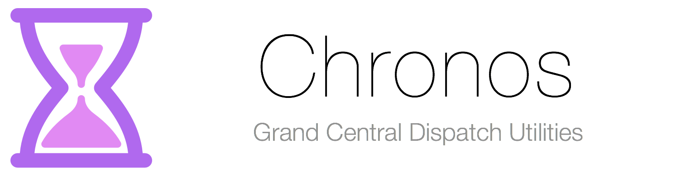

# Overview
[](https://travis-ci.org/comyarzaheri/Chronos)
[](http://cocoapods.org/?q=Chronos)
[](https://github.com/Olympus-Library/Chronos-Swift)
[]()
[](https://github.com/Olympus-Library/Chronos/blob/master/LICENSE)

Chronos is a collection of useful Grand Central Dispatch utilities. If you have any specific requests or ideas for new utilities, don't hesitate to create a new issue.

## Utilities

* **DispatchTimer** - A repeating timer that fires according to a static interval, e.g. "Fire every 5 seconds".
* **VariableTimer** - A repeating timer that allows you to vary the interval between firings, e.g. "Fire according to the function `interval = 2 * count`." 

# Usage 

### Quick Start

##### Cocoa Pods

Add the following to your Podfile:

```ruby
pod 'Chronos-Swift'
```
##### Carthage 

Add the following to your Cartfile:

```ruby
github "comyarzaheri/Chronos-Swift" "master"
```

### Using a Dispatch Timer

```swift
import Chronos

var timer = DispatchTimer(interval: 0.25, closure: {
            (timer: RepeatingTimer, count: Int) in
                println("Execute repeating task here")
            })

/** Starting the timer */
timer.start(true) // Fires timer immediately

/** Pausing the timer */
timer.pause()

/** Permanently canceling the timer */
timer.cancel()

```

### Using a Variable Timer

```swift
import Chronos

var variableTimer: VariableTimer = VariableTimer(closure: { 
            (timer: RepeatingTimer, count: Int) -> Void in
                println("Execute repeating task here")
        }) {(timer: VariableTimer, count: Int) -> Double in
                return Double(2 * count) // Return interval according to function
        }

/** Starting the timer */
timer.start(true) // Fires timer immediately

/** Pausing the timer */
timer.pause()

/** Permanently canceling the timer */
timer.cancel()

```

# Requirements

* iOS 8.0 or higher
* OS X 10.10 or higher

# License 

Chronos is available under the [MIT License](LICENSE).

# Contributors

* [@comyarzaheri](https://github.com/comyarzaheri)
* [@schun93](https://github.com/schun93)
